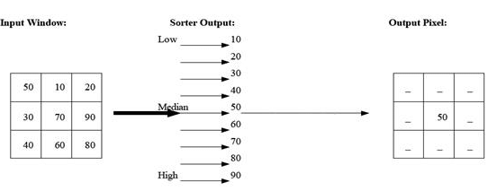
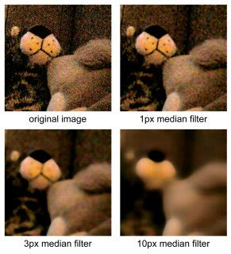
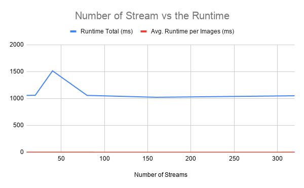
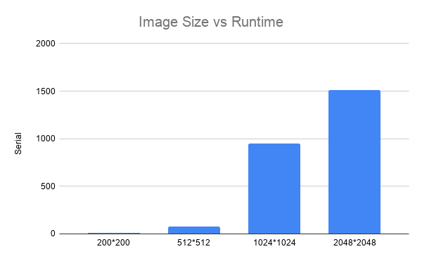
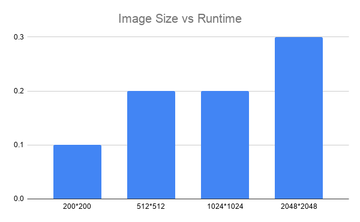

 

# Image Filters in CUDA

John Naylor

### abstract
 
 In an effort to understand the most effective method for optimizing the speed and lowering the runtime for image filters, a common image filter for denoising images, called the median filter, was implemented using CUDA, an sdk released by Nvidia for programming on their GPU architecture. This implementation was compared against a serial (i.e. non-CUDA version) as well as with various available options in the CUDA implementation tuned. The comparisons were facilitated using one general dataset, that being the IRIS dataset of 1500 images of iris flowers, as well as with specific images of sizes 200x200, 512x512, 1024x1024, and 2048x2048. The results showed for all tests showed massive improvements on the GPU implementation compared to the serial implementation on both single images as well as one batch processing. The speeds retrieved from the demonstrate the viability of Real Time Image processing as processing a framerate of 60 frames per second would be completely possible using this implementation.
 
### Introduction

Manipulating and analyzing images is one of the most useful and interesting topics in the field of computer and data science. With so much of the world being ingested or displayed as an image, the amount of data, the speed at which data is collected, and the use cases for the data are growing exponentially. One of the most common methods for image manipulation is image filtering. This technique involves operating on a pixel by pixel basis to transform one image to another. There are a wide variety of image filters, some very simple and straight forward while others are more complex. 

One particularly popular and widely used image filter is called the $median filter$. This filter's primary purpose is to denoise and soften images. Specifically salt and pepper noise which looks like dark or corrupted pixels on the image. The way this filter operates on a pixel scale, is by looking at the surrounding neighboring pixels, specified by the size of the window desired, in an image, storing them in a list, and selecting the median value from that list. That selected median value is now the new pixel value for the pixel that was operated on. This is a fairly simple algorithm but there is an edge case. Border pixels that don't have enough neighboring pixels to satisfy the window size requirement are generally cropped out of the image, thus making the image smaller slightly in the process.

#### Median Filter

#### Median Filter Example

Graphics Processing Units (GPUs) are specialized processing units made specifically are operating on images and graphics. Dedicated chips for graphics have been around since the 1970s starting with the first graphical user interfaces and video games but have become increasingly useful with the need for high performance computing in data science, machine learning, and even in digital currency. GPUs allow for doing billions of operating in parallel while also offering an advanced memory hierarchy to allow for varying level of memory I/O speeds and accessibility. It's clear that GPUs are the perfect hardware for performing image filtering. Even with high definition and pixel dense images, the GPU has the resources for one GPU thread per pixel. This means that for the majority of image filters, the median filter included, the operating can be done in near constant time. 

There are plenty of methods, historically, to program on the GPU but one very common method is using the software development kit (sdk) released by GPU manufacturer Nvidia called CUDA. CUDA is a compiler and set of C/C++ libraries for programming directly on the GPU and accessing the resources it has available. 

The feature particularly relevant to image filter is CUDA Streams. CUDA streams allow for an asynchronous programming design. Because the majority of the work done with images involves more than one image, being able to process them asynchronously massively increases the stability of the program. Rather than waiting for another image to finish before processing, the system is now able to process images from a queue whenever resources are available. This allows potentially multiple GPUs to be added to the system to increase the number of resources available.

### Related Works

The fields of image processing and GPU acceleration are thriving with support, motivation, and practical use cases encouraging and enabling new and interesting research as well as accelerating the discovery of new finding. 

In a paper published by the International Information Institute, researcher explored performing feature extraction on images in the IRIS dataset using GPU acceleration. There logic for using the IRIS dataset and GPU acceleration for their work was aligned with the reasoning behind the use of the IRIS dataset and GPU acceleration in this project. In the end, the researchers were able to get faster speeds and better accuracy my using a GPU rather a CPU for the images. 

In a different study published by, researchers set out to speed up the median filter, specifically the Branchless Vectorized Median (BVM) filter. The means by which they did that was also with GPU acceleration using the CUDA sdk. What they found seemed to indicate a decent viability for this project. They found that the GPU acceleration greatly improved the speed at which they could process images compared to normal CPU based parallelization. 

Looking at another group of researchers who used GPU acceleration for their research, Poostchi, M., Palaniappan, K., and Bunyak, F. took the median filter a set further and used it to detect motion on realtime video. With something requiring this much speed to get a proper framerate, GPU acceleration was necessary. The researchers investigated the possible framerates possible with different image sizes and found that even with large images (1K*1K) they could get a framerate capable of outputing realtime video.

The final reference article is a paper published which demonstrates how much more complex the analysis of images and the transformations possible can become. The researchers developed a method of combining the styles of two images into one. They called this Neural Style Transfer and it used machine learning techniques like neural networks and convolution. This paper demostrations the need for faster image manipulation programs. Without GPU acceleration or specialized hardware with tensor or neural cores, it would be almost impossible to run an algorithm like this in realtime. 

### Methodology

To start, two CUDA kernels were implemented for the GPU. The first for grey-scaling the image. This greatly simplified the pipeline by making sure every operation down the line only ran on one set of pixel values, that being the $0-255$ grey-scale, rather than four sets of pixel values for red, blue, green, and alpha. Moving along the pipeline, the other CUDA kernel implemented was the actual median filter kernel. This kernel would pull the greyscale image outputted from the first filter and run the median filter on it. The results of these filters would be copied back onto the GPU to be saved as separate images.

The dataset chosen to test the pipeline was the IRIS dataset. This contained roughly 1500 images of iris flowers which were useful for two major reasons: the contrast on the images made the median filter outputs more clear for comparison and the images were all within a reasonable dimension for general use (around 600*600 pixels). 

#### IRIS Dataset Sample

To upgrade the program to operate on images in batches, asynchronous libraries and CUDA streams, which are available in the CUDA sdk, were taken advantage of. The inclusion of these features transformed image ingestion, filtering, and all memory operations associated with the process to be something that can be packaged and places on a sort of queue or stream using CUDA jargon. Given that images are generally ingested in batches, just as they are being used in this project, this increased the speed and scalability of the system.

A few speed tests were run to gauge the programs speed. Everything was executed on VCU's high performance computing server "maple". The first was a general test using the entire IRIS dataset changing the amount of streams used on the GPU accelerated version. The GPU accelerated version was also tested against the serial version to get a baseline. The number CUDA streams are usually powers of 2 so 1, 2, 4, 8, 16, and 32 were all selected to measure if they would provide a speed up benefit on top of the normal GPU conversion. The next series of tests executed was against the size of the images versus the runtime developed from both implementations. Image sizes of 200\*200, $512\*512, 1024\*1024, and 2048\*2048 were used to understand speed differences. 

### Results

The results recorded from the first test showed some really clear results of the speed that can be achieved with the GPU. The serial version ran $85$ times slower than the version implemented in CUDA when batch processing the dataset of 1500 images. Interesting though, the number of streams used on the GPU accelerated version didn't change the runtime for the batch. This indicated that the GPU used wasn't able to accommodate multiple kernels of that size to run simultaneously. With more GPU, the speeds ups would be possible. 

\begin{table}[h]
\centering
\caption{Runtime vs Stream Count}
\begin{tabular}{| l | l | l | l | l | l | l | l |}
\toprule   & Serial  & 1    & 2       & 4     &  8     & 16     &  32  \\
\midrule Total(ms)  & 85000   & 1058  & 1060   &  1515  &  1058  &  1023  &  1051 \\
Avg(ms)  & 57    & 0.71    & 0.71   &  1.01  &  0.71  &  0.68  & 0.71  \\
\bottomrule
\end{tabular}

\end{table}

#### Runtime vs Stream Count

From the second set of tests, not only did the GPU accelerated version show faster speeds, but it also demonstrated its robustness to changes in image size. It seemed as the image size increased, the increase in runtime was very small compared to the serial version which grew quadratically with the image size. It seems that the only way to get a major slow down from the GPU accelerated version would be to find an image so high definition and pixel dense that it would have to be slip into two kernel calls to execute.

\begin{table}[h]
\centering
\caption{Image Size vs Runtime}
\begin{tabular}{| l | l | l |}
\toprule   
Image Size & Serial(ms)  & CUDA(ms)    \\
\midrule 
200*200  & 11   & 0.1  \\
512*512  & 77    & 0.2   \\
1024*1024  & 948    & 0.2  \\
2048*2048  & 1509    & 0.3   \\
\bottomrule
\end{tabular}

\end{table}

#### Runtime vs Image Size - Serial

#### Runtime vs Image Size - CUDA

### Conclusion

In an effort to understand the most effective method for optimizing the speed and lowering the runtime for image filters, a common image filter for denoising images, called the median filter, was implemented using CUDA, an sdk released by Nvidia for programming on their GPU architecture. The results from the tests reaffirm the usefulness and practical utility of GPU acceleration. With not also raw runtimes being an order of magnitude better but also scalability and robustness being improved by using asynchronous programming techniques and libraries as well as CUDA streams. 

In the future, it would be great to implement something involving a reduction set such as histogram segmentation which would require reducing the image to a histogram before calculating pixel values. This great complicates the parallelization process and might cause some difficulty on the GPU side of things. Along with that, another field of study to investigate further with this is real time image processing. The speeds achieved with the GPU accelerated version were plenty fast to be considered real time but perhaps doing something a bit more complicated to parallelize as well as moving to more resource scare hardware like internet of things devices or drones might stress the system to its limits. 

### References

1. Cho, Y., Kim, M., \& Woo, S. (2018). High-speed CUDA Algorithm for GPU-based Feature Extraction in Iris Images. International Information Institute (Tokyo). Information, 21(1), 239-248.

2. Chen, W., Beister, M., Kyriakou, Y., \& Kachelrieß, M. (2009, October). High performance median filtering using commodity graphics hardware. In 2009 IEEE Nuclear Science Symposium Conference Record (NSS/MIC) (pp. 4142-4147). IEEE.

3. Poostchi, M., Palaniappan, K., Bunyak, F., \& Seetharaman, G. (2012, December).Realtime motion detection based on the spatio-temporal median filter using GPU integral histograms. In Proceedings of the Eighth Indian Conference on Computer Vision, Graphics and Image Processing (pp. 1-8).

4. Gatys, L. A., Ecker, A. S., \& Bethge, M. (2015). A neural algorithm of artistic style. arXiv preprint arXiv:1508.06576.
